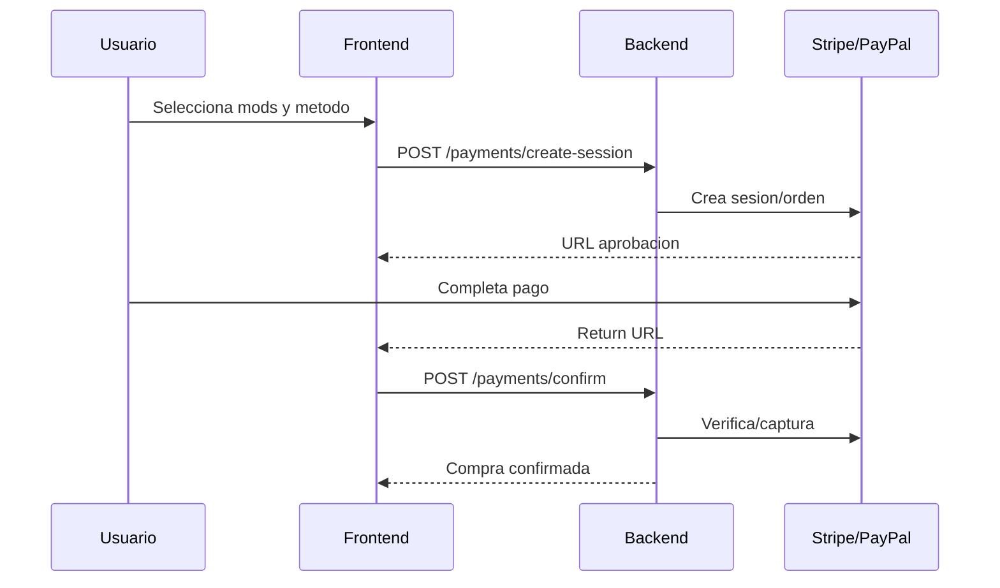
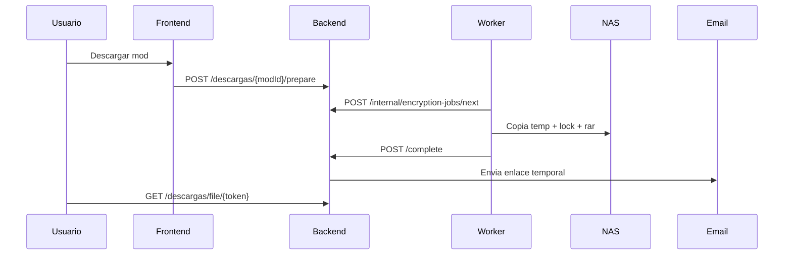

# GPB Mods WebAPP

Plataforma e-commerce de mods para GP Bikes con autenticacion JWT/Discord, pagos (simulados y reales), cifrado por GUID, entrega segura por enlace temporal y paneles completos de usuario y administracion.

## Tabla de contenidos

- [Vision general](#vision-general)
- [Stack tecnologico](#stack-tecnologico)
- [Arquitectura](#arquitectura)
- [Implementaciones cerradas](#implementaciones-cerradas)
- [Quick start](#quick-start)
- [Configuracion por entorno](#configuracion-por-entorno)
- [API REST](#api-rest)
- [Flujos E2E](#flujos-e2e)
- [Seguridad](#seguridad)
- [Worker de cifrado](#worker-de-cifrado)
- [Base de datos](#base-de-datos)

## Vision general

- Proyecto preparado para produccion con `Spring Boot + Angular + MariaDB + Nginx + Worker PowerShell`.
- Flujo completo implementado: compra -> confirmacion -> cifrado por GUID -> enlace temporal -> email de entrega.
- Diseno orientado a operacion real: monitoreo de cola, reintentos, limpieza automatica y herramientas admin para soporte.

## Stack tecnologico


### Versiones detectadas

- Backend: `Spring Boot 4.0.6`, `Java 17`, `JJWT 0.11.5`, `springdoc-openapi 2.5.0`.
- Frontend: `Angular 21.2.x`, `TypeScript 5.9.x`, `RxJS 7.8.x`, `npm 11.9.0`.
- Orquestacion: `docker-compose.prod.yml` con Compose `3.8`.

## Arquitectura

```text
[ Angular + Nginx ]  <--HTTP-->  [ Spring Boot API ]  <--JPA--> [ MariaDB ]
        |                                  |
        |                                  +--> [ SMTP ]
        |
        +----------------------------------> [ /api/descargas/file/{token} ]

[ PowerShell Worker ] <---X-Worker-Key---> [ /api/internal/encryption-jobs ]
        |
        +--> copy temp + lock.exe + rar + salida NAS
```

## Implementaciones cerradas

- Auth y usuarios:
  - JWT stateless, OAuth Discord y reset password por email.
  - GUID obligatorio formato `^[A-F0-9]{18}$` para compras/descargas.
  - Bloqueo total de cuentas desactivadas (`activo=false`) en login y uso de JWT.
- Catalogo:
  - Catalogo publico, detalle, showroom home y CRUD admin de mods.
  - Campo `carpetaBaseMod` por mod para resolver cifrado por estructura real de archivos.
- Pagos:
  - Simulacion (`/api/compras/checkout`) + Stripe Checkout + PayPal Orders.
  - Confirmacion backend (`/api/payments/confirm`) con verificacion real de estado de pago.
- Descargas:
  - Jobs `PENDING/RUNNING/DONE/FAILED`, claim atomico y token temporal expirable.
  - Entrega por email sin login (endpoint publico por token) y descarga autenticada por panel.
- Admin y soporte:
  - `/admin/users` con gestion de usuarios, compras, GUID y reenvio de emails de descarga.
  - Tickets y comentarios con reglas de ownership/permisos.
  - Dashboard con KPIs y estado NAS/cola de cifrado.

## Quick start

### Requisitos

- `Java 17+`
- `Node.js 22+` y `npm 11+`
- `MariaDB/MySQL`
- `Docker` y `Docker Compose`
- Worker: `Windows + PowerShell + lock.exe + rar`

### Desarrollo local

```bash
# Backend
cd backend
mvn spring-boot:run

# Frontend
cd frontend
npm install
npm start
```

### Produccion

```bash
docker compose -f docker-compose.prod.yml up -d --build
```

## Configuracion por entorno

### Variables backend

- `SPRING_DATASOURCE_URL`, `SPRING_DATASOURCE_USERNAME`, `SPRING_DATASOURCE_PASSWORD`
- `JWT_SECRET`, `FRONTEND_URL`
- `DISCORD_CLIENT_ID`, `DISCORD_CLIENT_SECRET`, `DISCORD_REDIRECT_URI`
- `SPRING_MAIL_HOST`, `SPRING_MAIL_PORT`, `SPRING_MAIL_USERNAME`, `SPRING_MAIL_PASSWORD`
- `STRIPE_SECRET_KEY`, `PAYPAL_CLIENT_ID`, `PAYPAL_CLIENT_SECRET`
- `MODS_IMAGES_DIRECTORY`, `MODS_FILES_DIRECTORY`
- `MODS_ENCRYPTION_WORKER_API_KEY`
- `MODS_DOWNLOAD_PUBLIC_BASE_URL`
- `MODS_DOWNLOAD_RETENTION_DAYS` (default `15`)
- `MODS_ENCRYPTION_RUNNING_TIMEOUT_MINUTES` (default `30`)
- `MODS_ENCRYPTION_MAINTENANCE_CRON` (default `0 */15 * * * *`)
- `PURCHASE_NOTIFY_ADMIN_EMAIL` (opcional)

### Variables compose/NAS

- `NAS_HOME_IMAGES_PATH`, `NAS_MODS_FILES_PATH`
- `BACKEND_HOST_PORT` (default `8081`)
- `FRONTEND_HOST_PORT` (default `4200`)

### Red y volumenes

- Red externa esperada: `webapp_proyecto_default`.
- Volumenes montados:
  - `NAS_HOME_IMAGES_PATH -> /data/home-images`
  - `NAS_MODS_FILES_PATH -> /data/mods-files`

## API REST

Base URL backend: `/api`

### Auth (`/api/auth`)

| Metodo | Endpoint | Auth | Uso |
|---|---|---|---|
| POST | `/auth/register` | Public | Registro con GUID 18 hex |
| POST | `/auth/login` | Public | Login y JWT |
| PUT | `/auth/profile` | JWT | Actualiza perfil |
| POST | `/auth/forgot-password` | Public | Solicita reset |
| POST | `/auth/reset-password` | Public | Confirma reset |
| GET | `/auth/discord/login` | Public | Inicio OAuth Discord |
| GET | `/auth/discord/callback` | Public | Callback OAuth Discord |

### Mods (`/api/mods`)

| Metodo | Endpoint | Auth | Uso |
|---|---|---|---|
| GET | `/mods/catalog` | Public | Catalogo |
| GET | `/mods/showroom` | Public | Destacados home |
| GET | `/mods/detail/{id}` | Public | Detalle mod |
| GET | `/mods/home-images` | Admin | Imagenes home |
| POST | `/mods` | Admin | Crear mod |
| PUT | `/mods/{id}` | Admin | Editar mod |
| DELETE | `/mods/{id}` | Admin | Borrar mod |

### Categorias (`/api/categorias`)

| Metodo | Endpoint | Auth | Uso |
|---|---|---|---|
| GET | `/categorias` | Public | Listado categorias |

### Compras y pagos

| Metodo | Endpoint | Auth | Uso |
|---|---|---|---|
| POST | `/compras/checkout` | JWT | Compra simulada |
| GET | `/compras/mis-compras` | JWT | Historial usuario |
| POST | `/payments/create-session` | JWT | Crea sesion Stripe/orden PayPal |
| POST | `/payments/confirm` | JWT | Verifica pago y persiste compras |

### Descargas y cifrado

| Metodo | Endpoint | Auth | Uso |
|---|---|---|---|
| POST | `/descargas/{modId}/prepare` | JWT | Crea/reusa job |
| GET | `/descargas/jobs/{jobId}` | JWT | Estado job |
| GET | `/descargas/file/{token}` | Public | Descarga por token |
| POST | `/internal/encryption-jobs/next` | Worker Key | Claim siguiente job |
| POST | `/internal/encryption-jobs/{id}/start` | Worker Key | RUNNING |
| POST | `/internal/encryption-jobs/{id}/complete` | Worker Key | DONE + token |
| POST | `/internal/encryption-jobs/{id}/fail` | Worker Key | FAILED |

### Comentarios y tickets

| Metodo | Endpoint | Auth | Uso |
|---|---|---|---|
| GET | `/mods/{modId}/comentarios` | Public | Comentarios por mod |
| GET | `/mods/ratings` | Public | Rating agregado |
| GET | `/comentarios/mis` | JWT | Comentarios del usuario |
| POST | `/mods/{modId}/comentarios` | JWT | Comentar mod comprado |
| DELETE | `/admin/comentarios/{id}` | Admin | Borrar comentario |
| POST | `/tickets` | JWT | Crear ticket |
| GET | `/tickets/mis-tickets` | JWT | Mis tickets |
| GET | `/tickets/{id}` | JWT | Detalle ticket |
| PUT | `/tickets/{id}/cerrar` | JWT | Cierre ticket usuario |
| GET | `/admin/tickets` | Admin | Bandeja admin |
| PUT | `/admin/tickets/{id}/responder` | Admin | Responder ticket |
| PUT | `/admin/tickets/{id}/cerrar` | Admin | Cierre ticket admin |

### Administracion (`/api/admin`)

| Metodo | Endpoint | Auth | Uso |
|---|---|---|---|
| GET | `/admin/stats` | Admin | KPIs + NAS |
| GET | `/admin/users` | Admin | Usuarios y compras |
| PUT | `/admin/users/{id}` | Admin | Editar usuario |
| PUT | `/admin/users/{userId}/purchases/{purchaseId}/guid` | Admin | Ajustar GUID compra |
| POST | `/admin/users/{userId}/purchases/{purchaseId}/resend-download-email` | Admin | Reenviar entrega |
| GET | `/admin/encryption-jobs/overview` | Admin | Cola cifrado |

### Ejemplos de payload

`POST /api/payments/create-session`

```json
{
  "provider": "stripe",
  "modIds": [1, 2]
}
```

`POST /api/payments/confirm`

```json
{
  "provider": "paypal",
  "externalId": "2P123456AB789012C",
  "modIds": [1, 2]
}
```

`POST /api/descargas/1/prepare`

```json
{}
```

## Flujos E2E

### Compra con pasarela



### Descarga cifrada por GUID



## Seguridad

- JWT stateless con `JwtAuthFilter`.
- CORS controlado por `FRONTEND_URL`.
- `SecurityConfig` separa rutas publicas, privadas y admin.
- Worker protegido con `X-Worker-Key`.
- Validaciones estrictas:
  - GUID `^[A-F0-9]{18}$`.
  - Sanitizacion `carpetaBaseMod` sin rutas relativas.
  - Verificacion de ownership en compras/tickets/jobs.
- Enlaces de descarga con expiracion, limpieza automatica y rotacion por nuevo job.

## Worker de cifrado

Archivo: `worker/encryption-worker.ps1`

Pipeline tecnico:

1. Claim atomico de job pendiente.
2. Copia de carpeta base del mod a directorio temporal.
3. Cifrado recursivo de `.pkz` con `lock.exe` y GUID del comprador.
4. Empaquetado en `.rar` con naming final por mod+GUID.
5. Movimiento a `compras/<GUID>` y notificacion al backend.
6. Limpieza de temporales incluso en errores.

Comando lock:

```powershell
lock.exe <archivo.pkz> /<GUID>
```

## Base de datos

### Entidades principales

- `usuario`, `mods`, `categoria`, `compra`, `descarga`, `encryption_job`, `comentario`, `ticket`, `password_reset_tokens`.

### Diagrama ER (Mermaid)


## Documentacion API interactiva

- Swagger UI: `/swagger-ui/index.html`
- OpenAPI: `/v3/api-docs`

## Estructura del proyecto

```text
WebAPP/
  backend/
  frontend/
  docker-compose.prod.yml
```
