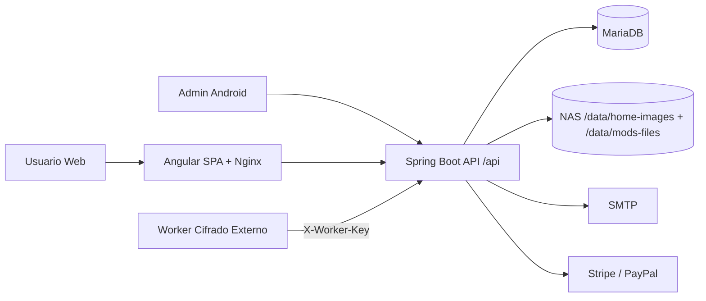
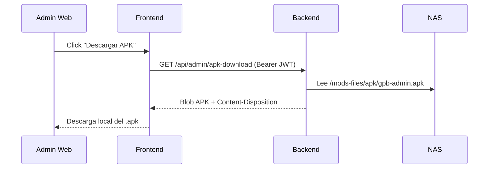
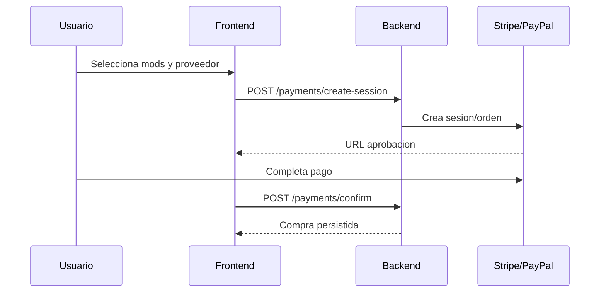
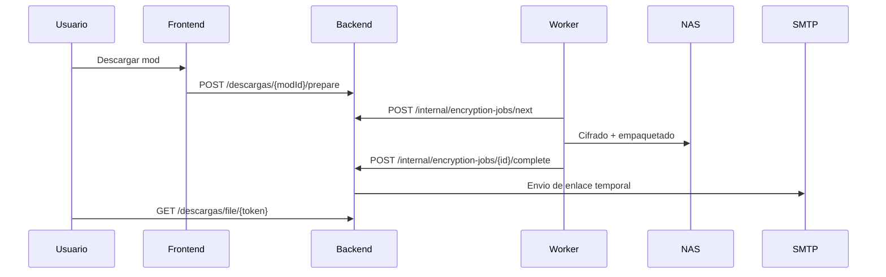

# GPB Mods WebAPP - Plataforma Completa (Web + API + Android Admin)

Plataforma e-commerce de mods para GP Bikes con autenticacion JWT/Discord, pagos (simulados y reales), cifrado por GUID, entrega segura por enlace temporal y paneles completos de usuario/administracion, mas app Android Admin para operacion interna.

## Stack tecnologico

| Capa | Tecnologia + version | Uso |
|---|---|---|
| Backend runtime |  | Base del backend |
| Backend framework |  | API REST |
| Seguridad backend |   | Auth stateless + roles |
| Persistencia backend |  | ORM y repositorios |
| Base de datos |  | Datos transaccionales |
| Email |  | Envio de enlaces |
| API docs |  | Documentacion interactiva |
| Frontend framework |  | SPA web |
| Frontend lenguaje |  | Lado cliente |
| Frontend runtime |   | Build y dev server |
| Android build |  | Compilacion app admin |
| Android SDK |   | Compatibilidad |
| Android red |   | Consumo API |
| Infra web |  | Servidor frontend |
| Orquestacion |  | Despliegue productivo |
| Integraciones pago |   | Checkout y confirmacion |

## Vision general

- Arquitectura principal: `Spring Boot + Angular + MariaDB + Nginx + NAS + Worker de cifrado + Android Admin`.
- Flujo operativo completo: compra -> confirmacion -> cifrado por GUID -> enlace temporal -> entrega por email.
- 3 entornos sincronizados:
  - `backend/`: seguridad, negocio, persistencia y APIs.
  - `frontend/`: tienda publica + dashboard usuario + panel admin.
  - `app/`: app Android Admin para operacion interna.

## Novedades recientes cerradas

### Backend + Frontend

- Catalogo con ordenes reales y default `Destacados`.
- Ranking `Mas vendidos` con `GET /api/mods/purchase-stats`.
- Slider de valoraciones recientes con `GET /api/mods/reviews/recent`.
- Dashboard admin reforzado con KPIs, NAS y cola de cifrado.
- Gestor dedicado de cola en `/admin/encryption-jobs`.
- Flujo de descargas endurecido:
  - reusa enlace DONE si existe archivo fisico;
  - si falta archivo, invalida estado y reencola.
- Endpoint admin para forzar generacion de enlace por compra:
  - `POST /api/admin/users/{userId}/purchases/{purchaseId}/prepare-download`.
- Descarga protegida de instalador Android en panel admin:
  - `GET /api/admin/apk-download`.

### Android Admin

- Dashboard Android alineado con metricas extendidas del backend.
- Cola con buscador/filtro por estado y detalle ampliado.
- Compras de usuario con acciones: actualizar GUID, reenviar email, generar enlace.
- Fix en edicion de showroom (`destacadoHome`, `ordenShowroom`).
- Ajustes de UI: margenes laterales, buscadores y separacion de cards.
- Adaptive launcher icon integrado (`ic_launcher` + `ic_launcher_round`).

## Topologia de entornos

| Entorno | Ruta | Rol | Consumido por |
|---|---|---|---|
| Backend API | `backend/` | Autenticacion, catalogo, pagos, compras, descargas, tickets, admin | Frontend + Android Admin + worker |
| Frontend Web | `frontend/` | Tienda y paneles de gestion | Usuarios finales y administradores |
| Android Admin | `app/` | Gestion operativa movil (users/mods/tickets/queue/dashboard) | Administradores |

## Arquitectura y diagramas

### Arquitectura global



### Descarga APK admin protegida



## Backend API REST

Base URL: `/api`

### Auth (`/auth`)

| Metodo | Endpoint | Auth | Uso |
|---|---|---|---|
| POST | `/auth/register` | Public | Registro |
| POST | `/auth/login` | Public | Login y JWT |
| PUT | `/auth/profile` | JWT | Actualiza perfil |
| POST | `/auth/forgot-password` | Public | Solicita reset |
| POST | `/auth/reset-password` | Public | Confirma reset |
| GET | `/auth/discord/login` | Public | Inicio OAuth Discord |
| GET | `/auth/discord/callback` | Public | Callback OAuth Discord |

### Mods (`/mods`)

| Metodo | Endpoint | Auth | Uso |
|---|---|---|---|
| GET | `/mods/catalog` | Public | Catalogo |
| GET | `/mods/showroom` | Public | Destacados home |
| GET | `/mods/purchase-stats` | Public | Compras por mod |
| GET | `/mods/detail/{id}` | Public | Detalle mod |
| GET | `/mods/home-images` | Admin | Imagenes home desde NAS |
| POST | `/mods` | Admin | Crear mod |
| PUT | `/mods/{id}` | Admin | Editar mod |
| DELETE | `/mods/{id}` | Admin | Eliminar mod |

### Compras, pagos y descargas

| Metodo | Endpoint | Auth | Uso |
|---|---|---|---|
| POST | `/compras/checkout` | JWT | Compra simulada |
| GET | `/compras/mis-compras` | JWT | Historial del usuario |
| POST | `/payments/create-session` | JWT | Inicia Stripe/PayPal |
| POST | `/payments/confirm` | JWT | Confirma pago |
| POST | `/descargas/{modId}/prepare` | JWT | Crea/reusa job cifrado |
| GET | `/descargas/jobs/{jobId}` | JWT | Estado job |
| GET | `/descargas/file/{token}` | Public | Descarga por token temporal |

### Admin (`/admin`)

| Metodo | Endpoint | Auth | Uso |
|---|---|---|---|
| GET | `/admin/stats` | Admin | KPIs + NAS |
| GET | `/admin/users` | Admin | Usuarios + compras |
| PUT | `/admin/users/{id}` | Admin | Editar usuario |
| PUT | `/admin/users/{userId}/purchases/{purchaseId}/guid` | Admin | Actualizar GUID compra |
| POST | `/admin/users/{userId}/purchases/{purchaseId}/resend-download-email` | Admin | Reenviar correo |
| POST | `/admin/users/{userId}/purchases/{purchaseId}/prepare-download` | Admin | Forzar enlace |
| GET | `/admin/encryption-jobs/overview` | Admin | Estado cola cifrado |
| GET | `/admin/apk-download` | Admin | Descarga `gpb-admin.apk` |

## Frontend Web

- Publico: `home`, `catalog`, `mod/:id`, `faq`, `politica-devoluciones`, `terminos-condiciones`.
- Usuario autenticado: `dashboard`, `checkout`, `support`.
- Admin: `admin`, `admin/mods`, `admin/users`, `admin/tickets`, `admin/encryption-jobs`.
- Mejoras recientes: ordenes de catalogo, valoraciones recientes, dashboard admin operativo, tarjeta `GPB Admin APP`.

## App Android Admin

### Arquitectura

- `Java + MVVM + Fragments + Navigation`.
- `ViewModel + LiveData` para estado de UI.
- `AdminRepository + AdminApi` sobre Retrofit/OkHttp.

### Pantallas clave

- Login admin.
- Dashboard de metricas (`AdminStatsResponse`).
- Usuarios y compras por usuario.
- Mods (CRUD + showroom).
- Tickets de soporte.
- Cola de cifrado con filtros (`PENDING/RUNNING/DONE/FAILED`).

### Iconos launcher (adaptive)

- `app/app/src/main/res/mipmap-anydpi-v26/ic_launcher.xml`
- `app/app/src/main/res/mipmap-anydpi-v26/ic_launcher_round.xml`
- `app/app/src/main/res/drawable/ic_launcher_background.xml`
- `app/app/src/main/res/drawable/ic_launcher_foreground.png`

### Build Android

```bash
cd app
.\gradlew.bat :app:assembleDebug
```

## Seguridad

- JWT stateless (`JwtAuthFilter` + `SecurityConfig`).
- CORS controlado por `FRONTEND_URL`.
- Worker interno protegido con `X-Worker-Key`.
- Validaciones criticas:
  - GUID obligatorio: `^[A-F0-9]{18}$`.
  - Ownership en compras/tickets/jobs.
  - Sanitizacion de rutas de mod.

## Worker de cifrado y NAS

- Estados de job: `PENDING`, `RUNNING`, `DONE`, `FAILED`.
- Flujo backend: claim -> start -> complete/fail.
- Nota: este repositorio incluye APIs internas del worker; el script operativo del worker no esta versionado aqui.

## Base de datos y evolucion de esquema

### Entidades principales

- `usuario`, `mods`, `categoria`, `compra`, `descarga`, `encryption_job`, `comentario`, `ticket`, `password_reset_tokens`.

### Cambios de esquema recientes

- `mods.destacado_home`, `mods.orden_showroom`, `mods.carpeta_base_mod`.
- `compra.guid_compra`.
- `encryption_job.status`, `mod_base_folder`, `output_relative_path`, `download_token`, `expires_at`, `notified_at`, `error_message`.

### Diagrama ER con atributos


### Estrategia de evolucion

- Runtime actual: `spring.jpa.hibernate.ddl-auto=update`.
- Recomendacion para produccion madura: migraciones versionadas con Flyway/Liquibase.

## Configuracion por entorno

### Variables backend

- `SPRING_DATASOURCE_URL`, `SPRING_DATASOURCE_USERNAME`, `SPRING_DATASOURCE_PASSWORD`
- `JWT_SECRET`, `FRONTEND_URL`
- `DISCORD_CLIENT_ID`, `DISCORD_CLIENT_SECRET`, `DISCORD_REDIRECT_URI`
- `SPRING_MAIL_HOST`, `SPRING_MAIL_PORT`, `SPRING_MAIL_USERNAME`, `SPRING_MAIL_PASSWORD`
- `STRIPE_SECRET_KEY`, `PAYPAL_CLIENT_ID`, `PAYPAL_CLIENT_SECRET`
- `MODS_IMAGES_DIRECTORY`, `MODS_FILES_DIRECTORY`
- `MODS_ENCRYPTION_WORKER_API_KEY`
- `MODS_DOWNLOAD_PUBLIC_BASE_URL`
- `MODS_DOWNLOAD_RETENTION_DAYS` (default `15`)
- `MODS_ENCRYPTION_RUNNING_TIMEOUT_MINUTES` (default `30`)
- `MODS_ENCRYPTION_MAINTENANCE_CRON` (default `0 */15 * * * *`)

### Docker Compose / NAS

- `NAS_HOME_IMAGES_PATH`, `NAS_MODS_FILES_PATH`
- `BACKEND_HOST_PORT` (default `8081`)
- `FRONTEND_HOST_PORT` (default `4200`)
- Red externa esperada: `webapp_proyecto_default`

## Despliegue y ejecucion

### Desarrollo local

```bash
# Backend
cd backend
mvn spring-boot:run

# Frontend
cd frontend
npm install
npm start

# Android (debug)
cd app
.\gradlew.bat :app:assembleDebug
```

### Produccion

```bash
docker compose -f docker-compose.prod.yml up -d --build
```

## Flujos E2E

### Compra y confirmacion



### Cifrado y entrega por token



## QA rapido recomendado

1. Catalogo: validar orden por `Destacados`, `Mas vendidos` y filtros.
2. Home: validar slider de valoraciones (desktop + movil con swipe).
3. Admin web: dashboard, cola cifrado, NAS y descarga `GPB Admin APP`.
4. APK admin: validar `200` con admin y `401/403` sin permisos, `404` sin archivo.
5. Android admin: users/mods/tickets/queue + acciones de compras (GUID, reenviar, preparar enlace).

## Documentacion API

- Swagger UI: `/swagger-ui/index.html`
- OpenAPI JSON: `/v3/api-docs`

## Estructura del proyecto

```text
WebAPP/
  app/                      # Android Admin (Java, MVVM, Fragments)
  backend/                  # API Spring Boot
  frontend/                 # Angular SPA
  docker-compose.prod.yml
  README.md
```

## Autor

**Javier Lanzas González**

## Licencia

Este proyecto se distribuye bajo licencia **Creative Commons BY-NC-SA 4.0**.


