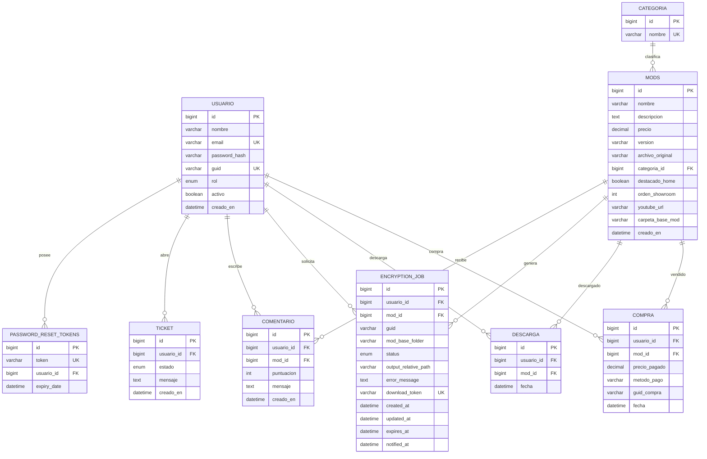

# GPB Mods WebAPP

Plataforma e-commerce de mods para GP Bikes con autenticacion JWT/Discord, compras (simuladas y reales), cifrado por GUID, entrega por enlace temporal y paneles de administracion/usuario.

## Stack Tecnologico


## Versiones Reales Detectadas

- Backend: `Spring Boot 4.0.6`, `Java 17`, `JJWT 0.11.5`, `springdoc-openapi 2.5.0`.
- Frontend: `Angular 21.2.x`, `TypeScript 5.9.x`, `RxJS 7.8.x`, `npm 11.9.0`.
- Deploy: `docker-compose.prod.yml` (Compose `3.8`).

## Arquitectura

```text
[ Angular + Nginx ]  <--HTTP-->  [ Spring Boot API ]  <--JPA--> [ MariaDB ]
        |                                  |
        |                                  +--> [ SMTP (emails) ]
        |
        +----------------------------------> [ Downloads API / token ]

[ PowerShell Worker ] <---X-Worker-Key---> [ Internal Encryption API ]
        |
        +--> lock.exe + RAR sobre carpeta temporal
        +--> salida en NAS (/data/mods-files/compras/<GUID>)
```

## Modulos Implementados

- Autenticacion y usuarios:
  - Registro/login JWT.
  - OAuth Discord (`/api/auth/discord/*`).
  - Recuperacion de password por token email.
  - Edicion de perfil y GUID.
  - Bloqueo de cuentas desactivadas (`activo=false`).
- Catalogo/mods:
  - Catalogo, detalle, showroom destacado.
  - CRUD de mods para admin.
  - Categorias dinamicas.
- Pagos y compras:
  - Simulacion (`/api/compras/checkout`).
  - Stripe Checkout y PayPal Orders con confirmacion backend.
  - Registro de compras idempotente por `usuario+mod`.
  - Emails: recibo usuario + notificacion admin.
- Descargas y cifrado:
  - Cola `EncryptionJob` (PENDING/RUNNING/DONE/FAILED).
  - Worker externo con claim atomico de jobs.
  - Cifrado por GUID (18 hex) usando `lock.exe`.
  - Enlace temporal por token publico con expiracion.
  - Reintento y reenvio manual de correo de descarga.
- Soporte/comunidad:
  - Tickets con respuesta admin y cierre.
  - Comentarios/valoraciones en mods comprados.
- Observabilidad admin:
  - Stats de ventas/usuarios/tickets.
  - Estado NAS y overview de cola de cifrado.

## Requisitos

- `Java 17+`
- `Node.js 22+` y `npm 11+`
- `MariaDB/MySQL`
- `Docker` + `Docker Compose`
- Para worker de cifrado: `Windows + PowerShell + lock.exe + rar`

## Variables de Entorno Criticas

### Backend

- `SPRING_DATASOURCE_URL`
- `SPRING_DATASOURCE_USERNAME`
- `SPRING_DATASOURCE_PASSWORD`
- `JWT_SECRET`
- `FRONTEND_URL`
- `DISCORD_CLIENT_ID`
- `DISCORD_CLIENT_SECRET`
- `DISCORD_REDIRECT_URI`
- `SPRING_MAIL_HOST`
- `SPRING_MAIL_PORT`
- `SPRING_MAIL_USERNAME`
- `SPRING_MAIL_PASSWORD`
- `STRIPE_SECRET_KEY`
- `PAYPAL_CLIENT_ID`
- `PAYPAL_CLIENT_SECRET`
- `MODS_IMAGES_DIRECTORY`
- `MODS_FILES_DIRECTORY`
- `MODS_ENCRYPTION_WORKER_API_KEY`
- `MODS_DOWNLOAD_PUBLIC_BASE_URL`
- `MODS_DOWNLOAD_RETENTION_DAYS` (default `15`)
- `MODS_ENCRYPTION_RUNNING_TIMEOUT_MINUTES` (default `30`)
- `MODS_ENCRYPTION_MAINTENANCE_CRON` (default `0 */15 * * * *`)
- `PURCHASE_NOTIFY_ADMIN_EMAIL` (opcional)

### Compose/NAS

- `NAS_HOME_IMAGES_PATH`
- `NAS_MODS_FILES_PATH`
- `BACKEND_HOST_PORT` (default `8081`)
- `FRONTEND_HOST_PORT` (default `4200`)

## Ejecucion

### Desarrollo local

```bash
# backend
cd backend
mvn spring-boot:run

# frontend
cd frontend
npm install
npm start
```

### Produccion (Portainer/NAS)

```bash
docker compose -f docker-compose.prod.yml up -d --build
```

## Endpoints API

Base URL backend: `/api`

### Auth (`/api/auth`)

| Metodo | Endpoint | Auth | Descripcion |
|---|---|---|---|
| POST | `/auth/register` | Public | Registro de usuario con GUID 18 hex |
| POST | `/auth/login` | Public | Login y emision JWT |
| PUT | `/auth/profile` | JWT | Actualiza nombre/email/password/guid |
| POST | `/auth/forgot-password` | Public | Solicita reset por email |
| POST | `/auth/reset-password` | Public | Restablece password con token |
| GET | `/auth/discord/login` | Public | Redirect OAuth Discord |
| GET | `/auth/discord/callback` | Public | Callback OAuth Discord |

### Catalogo/Mods (`/api/mods`)

| Metodo | Endpoint | Auth | Descripcion |
|---|---|---|---|
| GET | `/mods/catalog` | Public | Lista completa de mods |
| GET | `/mods/showroom` | Public | Top 3 destacados home |
| GET | `/mods/detail/{id}` | Public | Detalle de mod |
| GET | `/mods/home-images` | Admin | Lista imagenes home disponibles |
| POST | `/mods` | Admin | Crear mod |
| PUT | `/mods/{id}` | Admin | Actualizar mod |
| DELETE | `/mods/{id}` | Admin | Eliminar mod |

### Categorias (`/api/categorias`)

| Metodo | Endpoint | Auth | Descripcion |
|---|---|---|---|
| GET | `/categorias` | Public | Lista de categorias |

### Compras (`/api/compras`)

| Metodo | Endpoint | Auth | Descripcion |
|---|---|---|---|
| POST | `/compras/checkout` | JWT | Compra simulada (o validacion metodo) |
| GET | `/compras/mis-compras` | JWT | Historial del usuario |

### Pagos (`/api/payments`)

| Metodo | Endpoint | Auth | Descripcion |
|---|---|---|---|
| POST | `/payments/create-session` | JWT | Crea sesion Stripe u orden PayPal |
| POST | `/payments/confirm` | JWT | Verifica/captura pago y registra compras |

### Descargas (`/api/descargas`)

| Metodo | Endpoint | Auth | Descripcion |
|---|---|---|---|
| POST | `/descargas/{modId}/prepare` | JWT | Crea/reusa job de cifrado |
| GET | `/descargas/jobs/{jobId}` | JWT | Estado del job |
| GET | `/descargas/file/{token}` | Public | Descarga archivo temporal |

### Internal Worker (`/api/internal/encryption-jobs`)

Requiere header `X-Worker-Key`.

| Metodo | Endpoint | Auth | Descripcion |
|---|---|---|---|
| POST | `/internal/encryption-jobs/next` | Worker Key | Claim del siguiente job |
| POST | `/internal/encryption-jobs/{id}/start` | Worker Key | Marca RUNNING |
| POST | `/internal/encryption-jobs/{id}/complete` | Worker Key | Marca DONE y genera token |
| POST | `/internal/encryption-jobs/{id}/fail` | Worker Key | Marca FAILED |

### Comentarios y valoraciones (`/api`)

| Metodo | Endpoint | Auth | Descripcion |
|---|---|---|---|
| GET | `/mods/{modId}/comentarios` | Public | Comentarios de un mod |
| GET | `/mods/ratings` | Public | Media/total por mod |
| GET | `/comentarios/mis` | JWT | Comentarios del usuario |
| POST | `/mods/{modId}/comentarios` | JWT | Comentar mod comprado |
| DELETE | `/admin/comentarios/{id}` | Admin | Borrar comentario |

### Tickets soporte (`/api`)

| Metodo | Endpoint | Auth | Descripcion |
|---|---|---|---|
| POST | `/tickets` | JWT | Crear ticket |
| GET | `/tickets/mis-tickets` | JWT | Tickets del usuario |
| GET | `/tickets/{id}` | JWT | Detalle ticket (owner/admin) |
| PUT | `/tickets/{id}/cerrar` | JWT | Cerrar ticket propio |
| GET | `/admin/tickets` | Admin | Listado completo |
| PUT | `/admin/tickets/{id}/responder` | Admin | Responder ticket |
| PUT | `/admin/tickets/{id}/cerrar` | Admin | Cerrar ticket admin |

### Admin (`/api/admin`)

| Metodo | Endpoint | Auth | Descripcion |
|---|---|---|---|
| GET | `/admin/stats` | Admin | KPI + estado NAS |
| GET | `/admin/users` | Admin | Usuarios + compras agregadas |
| PUT | `/admin/users/{id}` | Admin | Editar usuario |
| PUT | `/admin/users/{userId}/purchases/{purchaseId}/guid` | Admin | Editar GUID de compra |
| POST | `/admin/users/{userId}/purchases/{purchaseId}/resend-download-email` | Admin | Reenviar email de descarga |
| GET | `/admin/encryption-jobs/overview` | Admin | Estado de la cola cifrado |

## Seguridad

- JWT stateless con `JwtAuthFilter`.
- CORS controlado por `FRONTEND_URL`.
- Endpoints publicos permitidos explicitamente en `SecurityConfig`.
- Validaciones criticas:
  - GUID: `^[A-F0-9]{18}$`.
  - Sanitizacion de `carpetaBaseMod` (`[A-Za-z0-9._-]` sin rutas relativas).
  - Ownership checks en tickets/jobs/compras.
- Descargas por token con expiracion y limpieza periodica.

## Worker de Cifrado

Archivo: `worker/encryption-worker.ps1`

Pipeline:
1. Solicita job (`/next`).
2. Copia mod base a carpeta temporal.
3. Ejecuta lock recursivo con GUID.
4. Empaqueta `.rar`.
5. Mueve salida a `compras/<GUID>`.
6. Informa `complete` o `fail`.

Comando esperado de lock:

```powershell
lock.exe <archivo.pkz> /<GUID>
```

## Modelo de Datos (ERD)



## Frontend (Rutas principales)

- Publicas: `/home`, `/catalog`, `/mod/:id`, `/login`, `/register`, `/faq`, `/terminos-condiciones`, `/politica-devoluciones`, `/discord`.
- Protegidas: `/checkout`, `/dashboard`, `/support`, `/complete-profile`.
- Admin: `/admin`, `/admin/mods`, `/admin/tickets`, `/admin/users`.

## Operacion y Mantenimiento

- `EncryptionJobMaintenanceService`:
  - Marca jobs RUNNING expirados como FAILED.
  - Limpia descargas expiradas.
  - Reintenta notificaciones pendientes.
- Dashboard admin con overview de cola y estado SMTP.
- NAS monitorizado desde `/api/admin/stats`.

## Validacion E2E Recomendada

1. Registro/login y OAuth Discord.
2. Compra simulada + Stripe + PayPal.
3. Confirmacion backend y persistencia de compras.
4. Preparacion descarga -> RUNNING -> DONE.
5. Email con enlace temporal funcional sin login.
6. Reenvio manual por admin y expiracion de enlace.

## Documentacion API interactiva

- Swagger UI: `/swagger-ui/index.html`
- OpenAPI JSON: `/v3/api-docs`

## Estructura del proyecto

```text
WebAPP/
  backend/                  # Spring Boot API
  frontend/                 # Angular app
  worker/                   # PowerShell encryption worker
  docker-compose.prod.yml   # Stack de produccion
```
